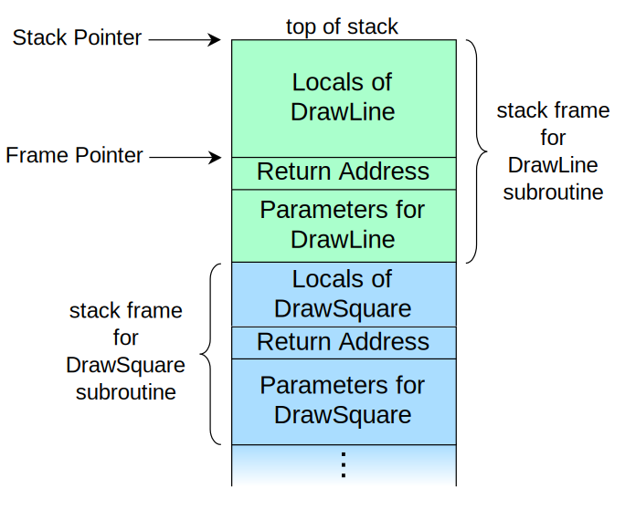

# Weekly Report 4

[@Neil Zhao](https://github.com/zzrcxb)

## 0. Pipeline

如果对Concolic execution的整个高层次流水过程没有异议的话, 我将使用下面的过程来进行描述, 并且所有的讨论也基于下面的框架:


## 1. Find branches 

想要测试各个分支可能发生的情况, 第一步就是如何找到分支. 以我们测试的x86_64平台为例, 一般来说都利用一些第三方的工具将汇编码翻译成一种相对高级的中间码, 在这个过程中, 所有的跳转都已经被找到. 而这个过程中可能出现的差错并不是我们关注的重点. 所以下面的讨论就认为转换的工作是无差错的. 也就是所有的分支指令都正确地被捕捉到. 但是有一些情况下, 分支是无法被正确的处理的, 比如像MIPS CPU里面的jr (跳转到某个寄存器的地址)指令. 如果程序中有这样的行为, 并且在程序跳转之前, 我们还可以去更改这个寄存器的值, 那么这就会带来很严重的问题. 因为理论上, 这时候程序可以在整个虚拟内存空间上进行跳转 (虽然操作系统会禁止这种行为), 即使是在程序本身的段中进行跳跃, 往往也是不可接受的. 主要是会导致整个可能的分支情况的数量过于庞大, 以至于没有足够的能力对其进行分析, 除非我们通过某种手段告诉分析工具, 这个跳转的地址有哪些限制条件, 否则将不可能正确处理这种情况, 这也就是文中所提到的Symbolic jump的Logic bomb.

## 2. Get Symbolic variables

在讨论之前, 我先将程序中涉及到的变量依据其在分支时所起的作用进行一次划分, 我将其分为直接变量, 间接变量, 无关变量. 下面将对这几个概念进行说明:

- 直接变量: 即与某一次分支判断有关的, 我们需要去为此生成Test case的变量, 也就是与某一次分支相关的Symbolic variable.
- 间接变量: 参与某一次分支判断, 但是其值是"确定"的, 这里的确定的含义不是说这个变量是常量, 而是这个变量运行到这里是值是确定的. 虽然这种变量在运行时会参与分支判断, 但是我们不会为此生成Test case.
- 无关变量: 与某一次分支判断无关的变量.

下面的例子用来解释这个概念.

```c
int main() {
    int i, j;
  	int a = 10;

	a = a * 2 - 5;
  	scanf("%d", i);
	
  	// i is a direct variable, a is an indirect variable, j is an irrelevant variable.
  	if (i + a < 20)
      	return 1;
  	else
      	return 0;
}
```

在这一步事实上只需要根据分支条件对涉及到的进行逆推就可以得到所涉及的所有的变量, 并不会有潜在的错误.

但是问题出在了间接变量上, 当间接变量是一个临界变量的时候, 如果没有正确地实现锁, 在使用工具分析的时候会引发不可预计的后果. 有关临界变量的问题, 下面会再提到的.

## 3. Get Constraints

在获取约束模型的这一步, 是整个Concolic Execution中非常重要也是最容易出现问题的一步. 对于一般的只涉及到简单的加减乘除以及一些位运算, 逻辑比较这种比较基础的分支判断, 可以很好地生成一个AST, 方便进一步研究, 但是由于条件运算可能会涉及到一些函数调用, 这就会导致AST节点上多出一种叫做函数的节点类型. 这样的做法当然不会有什么问题, 关键是在下一步会带来很严重的影响.

## 4. Solve Constraints

尝试解约束, 是一个很简单的想法, 就像去解方程一样, 解方程的引擎需要"智能"地去找到符合分支语句的情况或者是发现条件不可能成立. 但是问题就是, 怎么去解方程.

### a. 方程过于复杂

比如在这个例子, Angr在运行step时花了很长时间, Triton则输出结果有误, 即使只有最基本的加减乘除运算, 也可能会因为有高次多项式或者复杂的分式的参与而导致引擎无法解出来.

```c
int check() {
    double i, j;
    if ((i * i + j * j) / (2 * i * j) < 0.5)
        return 1;
    else
        return 0;
}
```

### b. 缺乏约束条件

一些对于临界条件处理并不是非常好的程序, 在进行测试的时候, 可能会因为ELF文件缺乏足够的约束条件而出错, 比较典型的例子如下:

```c
int check() {
	int a[] = {0, 1, 2, 3, 4, 5, 6, 7, 8, 9};
	int i;

    if (a[i] > 9)
        return 1;
    else
        return 0;
}
```

在这个一维数组的Challenge中, 很显然, 对于"合乎规范的" i 来说, 这个程序一定是返回0, 这是由于我们知道这里这个数组的大小为10, 我们不能越界访问. 但是, 这个信息对于二进制文件来说是不存在的, 所以分析器也不得而知. 而我们知道, 函数调用栈的结构简单来说如[下图](https://en.wikipedia.org/wiki/Call_stack)所示:



函数的局部变量全部保存在了返回地址上面 (这里不讨论C99之后的[Variable-length array](https://en.wikipedia.org/wiki/Variable-length_array), 那个的一种实现是存在堆里的). 在忽略内存的对齐情况下, 我们可以认为这些局部变量都是被"挤"在了上面的那个空间. 我们无从得知是否在越界访问数组, 这完全得靠程序员的"自觉". 所以分析工具即使能够建模出内存的使用, 也无法处理Symbolic variable作为下标进行访问的情况. 比如上面的那个例子, Triton无法解出约束, 而angr则表示程序有两种结果. 这两个处理方式都不够好, 当然, 如果生成了让程序进行越界访问的下标作为测试样例输入, 导致测试可能失败, 也是一个能让程序员发现自己的代码不安全的地方, 进行改进. 但是很多时候, 一些"内部的"函数在操作的时候, 我们已经完全可以控制输入的下标, 即用户无法干涉输入下标的时候, 输出越界访问的样例还是一个有一些累赘的做法.

除了数组访问这个典型的案例外, 比如月份, 时间等变量, 其都有明确的取值范围, 检测程序可能会输出非法的不符合常识的值, 但是从提升目标程序的健壮性角度来说, 还是可以接受的.

### c. 临界变量

在之前的文章中, 提到了一个多线程的例子. 为了阅读方便, 我将例子重现在下面:

```c
void* inc(void* i) {
    int* j = (int*)i;
    *j += 1;
}

int check() {
    pthread_t thread;
    int i = 'a';
    int rc = pthread_create(&thread, NULL, inc, (void*)&i);
    rc = pthread_join(thread, NULL);
    switch(i) {
        case 'b': return 1;
        case 'c': return 2;
        default: return 0;
    }
}
```

事实上, 这个例子并不是一个本质上的Logic bomb, 测试工具的失败是由于其自身的缺陷所致. 只要工具能够对不同平台程序的多线程模型进行正确的建模, 那个bomb是不成立的. 真正影响测试工具的是缺乏妥善的"锁"的机制的多线程程序. 无论是直接变量还是间接变量, 当它们在多线程程序中作为一个临界变量的时候, 都会导致测试程序失败.

```c
void* inc(void* i) {
    int* j = (int*)i;
    *j += 1;
}

int check() {
	pthread_t thread1, thread2;
	int i;
	int rc = pthread_create(&thread1, NULL, inc, (void*)&i);
  	int rc = pthread_create(&thread2, NULL, inc, (void*)&i);
	if (i > 10) {
      pthread_join(thread1, NULL);
      pthread_join(thread2, NULL);
      return 1;
    }
  	else {
      pthread_join(thread1, NULL);
      pthread_join(thread2, NULL);
      return 0;
  	}
}
```

很显然, 在进入条件语句的时候, 由于 i 没有锁, 其值会在同时被两个线程更改, 由于这里两个线程的存在竞争关系, 所以测试工具无法建模出这两个线程的运行情况, 即使能输出测试样例, 那也是无法复现的无意义的测试样例.

