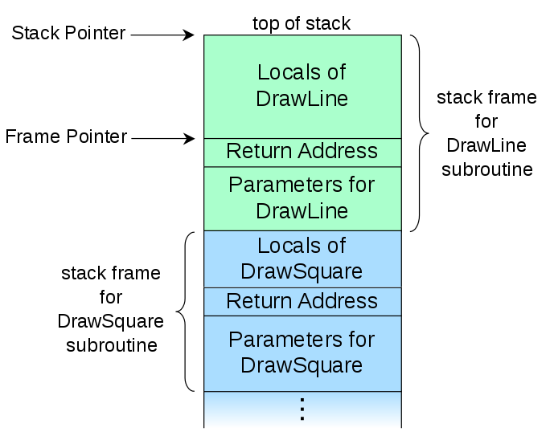

# Records and Analysis

[@Neil Zhao](https://github.com/zzrcxb)

## 1. Array

### a. Test program

```c
int main(int argc, char**argv) {
    int a[] = {1, 2, 3, 4, 5, 6};
    int i = atoi(argv[1]);

    if (a[i] > 6)
        return 1;
    else
        return 0;
}
```

angr results:


```shell
➜  ConcTriton git:(master) ✗ python angr_run.py programs/a.out
WARNING | 2017-07-30 14:59:39,610 | claripy | Claripy is setting the recursion limit to 15000. If Python segfaults, I am sorry.


[*] Paths found: 2
[+] New Input: 6 | ASCII: 54
[+] New Input: 7 | ASCII: 55
```

Triton results:

```shell
➜  ConcTriton git:(master) ✗ make triton P="a.out 1"
echo "=== Using Triton ==="
=== Using Triton ===
/home/neil/Triton/build/triton triton_run.py programs/a.out 1
Before start analysis
Before run program
[+] Take Snapshot
[+] In main
[+] In main() we set :
Input data      [0x7ffc8f912752] = 49 1
[+] Exit point
[[5292L, 4195840L, 4195833L]]
Symbolic variables: {0L: SymVar_0:8}
input.bound 0
model: {}
2[+] Done !
```

As we can see, angr generated two "illegal" test cases, and Triton could not solve this kind of  problem.

### b. Analysis

As the picture I mentioned before. Function calling stack looks like the following figure.



And there is no way to know the size of static array. As EFL binary files don't contain any information about how large the array is. Symbolic constraints solve engine cannot find a appropriate way to avoid engine visiting memory out of the array. So, it may generate some test case can cause program encounter a **Segmentation Fault**.

When it comes to dynamic array which OS locates them in heap. Things don't get better. There is still no way to know its size. The only way we can reserve size information is define some structures or some high-level classes. Such as vector supported by C++. But test tools can only support these standard structures or classes which tools know where they can reach size information. As for some user-defined structures or classes, testers must provide some extra information about where the size information is stored.

So, unless we change binary files format to contain more information, otherwise theoretically no tool can solve this challenge. The best thing  programmer can do is to develop a good programming habit of always checking index before visiting elements of an array. And we can improve the test program to the following one:

```c
int main(int argc, char**argv) {
    int a[] = {1, 2, 3, 4, 5, 6};
    int i = atoi(argv[1]);

    if (i >= 0 && i < 6 && a[i] > 6)
        return 1;
    else
        return 0;
}
```

Even this program can only reach the "return 0" statement, but angr said it found two paths. I am still investigating causes.

```shell
➜  ConcTriton git:(master) ✗ python angr_run.py programs/a.out
WARNING | 2017-07-30 15:05:40,980 | claripy | Claripy is setting the recursion limit to 15000. If Python segfaults, I am sorry.


[*] Paths found: 2
[+] New Input: 8 | ASCII: 56
[+] New Input: 3 | ASCII: 51
```

## 2. Multithreading

### a. Test program

```c
#include <pthread.h>

void* inc(void* i) {
}

int main(int argc, char** argv) {
    pthread_t thread;
    int rc = pthread_create(&thread, NULL, inc, (void*)&NULL);

    rc = pthread_join(thread, NULL);
    return 0;
}
```

angr encountered some errors while stepping. Its IP was set to 0x0 after several steps. I've opened an issue on GitHub and I'm still waiting for official reply.

```python
In [1]: while len(pg.active) > 0:
            print pg.active[0].state.regs.ip
            pg.step()
Out[1]:
<BV64 0x400560>
<BV64 0x400530>
<BV64 0x50000b0>
<BV64 0x4006a0>
<BV64 0x4004f0>
<BV64 0x400505>
<BV64 0x4006d3>
<BV64 0x4006d8>
<BV64 0x400620>
<BV64 0x400648>
<BV64 0x4005c0>
<BV64 0x4005e2>
<BV64 0x4006ed>
<BV64 0x4006f6>
<BV64 0x50000c0>
<BV64 0x400653>
<BV64 0x400520>
<BV64 0x5000100>
<BV64 0x40064d>
<BV64 0x0>
<BV64 0x0>
```


Triton used almost 4G memory and got nothing.

### b. Analysis

// TODO

## 3. Overflow

### a. Test program

```c
#include <stdio.h>

int main(int argc, char** argv) {
    // Maximum of signed int: 2147483647
    int a = 2147483640;
    int b = atoi(argv[1]);
    int c = 2;

    if (a + b < 0 && b > 0)
        return 2;
    else if (c * b < 0 && b > 0)
        return 1;
    else
        return 0;
}
```


### b. Analysis


## 4. Float-point Number


## 5. Signed & Unsigned


## 6. File Reading


